# 🚗 Crash Risk Simulator

**Simulation-driven, two-stage machine learning system for predictive driving safety assessment — with physics-based verification, per-scenario explainability, and interactive risk exploration.**

🔗 **[Live Demo →](https://crash-risk-simulator.streamlit.app/)**

---

## The Problem, Today

Road accidents are almost never caused by one single factor — they're multiple conditions stacking up at once: a driver going a little too fast, a following gap that's a little too short, rain making the road slippery, poor visibility at night, a heavier vehicle that takes longer to stop.

Two real gaps motivated this project:

1. **Real crash data is dangerous, expensive, and ethically impossible to collect at scale.** You can't stage thousands of real collisions to build a training set — usable data has to come from simulation, not real-world collection.
2. **Most risk tools give a single static number** (like an insurance score) instead of an interactive tool that explains *why* the risk is high and *what to change about it.*

## What This Project Is

A **what-if scenario simulator** — not a live telemetry tracker. The user sets a hypothetical driving scenario (speed, following distance, weather, road type, time of day, vehicle type) and the app:

- Predicts **crash probability** and, if relevant, **severity**
- **Cross-checks its own prediction** against classical physics, instead of trusting the model blindly
- Explains **why**, both generally and for that exact scenario
- Recommends concrete, actionable changes
- Lets the user explore, quiz themselves, compare models, and export a report

It's positioned as a **decision-support / risk-assessment tool** — closer to an insurance risk engine or a driver-training aid than to a self-driving system.

---

## Features

### Two complementary driving scenarios
- **🚨 Emergency Braking** — the vehicle ahead suddenly stops. Risk depends on the driver's own speed, reaction time, and following distance.
- **🚗 Dynamic Traffic** — both vehicles are moving; risk depends on the *relative* (closing) speed, not either car's absolute speed. 120 km/h following 118 km/h is low risk; 120 km/h following 70 km/h is high risk — even though "your speed" is identical in both cases.

### Core risk engine
- **Two-stage prediction** — crash probability (classification) → conditional severity (regression), instead of one blind regression that can't tell "no crash" from "small crash."
- **Real-world categorical inputs** (weather, road type, time of day, vehicle type) mapped internally to physics parameters (friction, reaction time, mass, brake efficiency) via multiplicative, range-based, clamped dependency rules.
- **Independent physics verification layer** — every ML prediction is cross-checked against a classical stopping-distance formula, with three explicit states: agree / borderline-uncertain / disagree.

### Explainability, at two levels
- **Risk Contribution bars** — what generally matters, across the full range of each factor.
- **Per-scenario SHAP explanation** *(on-demand)* — for this exact scenario, how much did each factor push the prediction up or down from the model's baseline. Handles whichever model type wins Stage 1 (Logistic Regression, Decision Tree, Random Forest, or Gradient Boosting) uniformly, in probability-space.

### Actionable output, not just a number
- **Recommendation engine** — *"Reduce speed by 61 km/h (to 29 km/h) → crash probability drops from 92% to about 48%,"* computed directly from the model's own sensitivity sweep.
- **Safe speed / safe following-distance boundaries**, reverse-calculated automatically for whichever direction is actually risky for that parameter.
- **Sensitivity sweep charts** for speed, distance, or any of the 6 underlying physics parameters, each with a threshold line, a risk gradient, and the current scenario marked directly on the curve.

### Making it easy to explore
- **Scenario presets** (Heavy Rain, Fog, Night Highway, Traffic Jam, School Zone) for one-click demos.
- **Weather & time auto-fill** — type a city name, get real current conditions via the free, keyless Open-Meteo API, with autocomplete city search and automatic day/night detection from the location's own local time. Fails soft to manual selection if the city isn't found or the API is unreachable.
- **Quiz Mode** — guess the crash probability before the model reveals it; scored by closeness, with a running total. A no-login way to build intuition and demo the model interactively.
- **PDF export** — a full, professional risk report (scenario, prediction, safe boundaries, recommendations, risk-contribution chart) downloadable in one click.

### Transparency about the model itself
- **Model Evaluation Dashboard**, in-app — full comparison table for both stages (accuracy/precision/recall/F1/ROC-AUC for the classifier; R²/RMSE/MAE for the regressor), confusion matrix, and feature-importance plots.
- **Self-healing model loading** — if the saved model files can't be unpickled in a given deployment environment (a real cross-environment scikit-learn/Python version mismatch this project hit in practice), the app retrains fresh, lightweight models in-memory automatically rather than crashing.

---

## Architecture

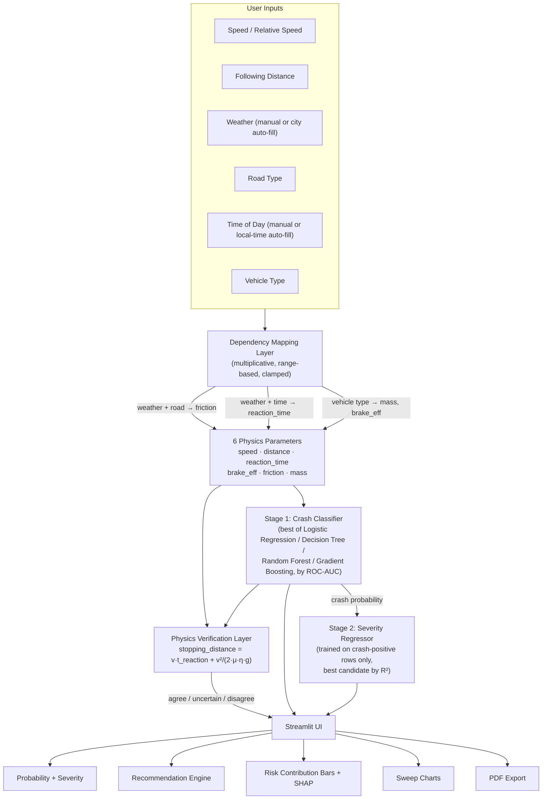

---

## Model Performance (current build)

**Stage 1 — Crash Classifier**

| Model | Accuracy | Precision | Recall | F1 | ROC-AUC |
|---|---|---|---|---|---|
| **Logistic Regression** ✅ | 0.9575 | 0.9579 | 0.9664 | 0.9621 | 0.9946 |
| Gradient Boosting | 0.9513 | 0.9493 | 0.9642 | 0.9567 | 0.9942 |
| Random Forest | 0.9500 | 0.9453 | 0.9664 | 0.9558 | 0.9925 |
| Decision Tree | 0.9188 | 0.9302 | 0.9239 | 0.9270 | 0.9181 |

**Stage 2 — Severity Regressor**

| Model | R² | RMSE | MAE |
|---|---|---|---|
| **Gradient Boosting** ✅ | 0.9683 | 172,029 | 117,755 |
| Random Forest | 0.9551 | 204,805 | 135,921 |
| Decision Tree | 0.8818 | 332,340 | 223,112 |
| Linear Regression | 0.8453 | 380,197 | 278,193 |

*Features used: `speed`, `distance`, `reaction_time`, `brake_eff`, `friction`, `mass` · Random seed: 42*

Full comparison, confusion matrix, and feature-importance plots are viewable live in the app's **Model Evaluation Dashboard**.

---

## Screenshots

> Save your screenshots into a `screenshots/` folder in the repo root with the filenames below, and they'll render automatically here.

**Home page**
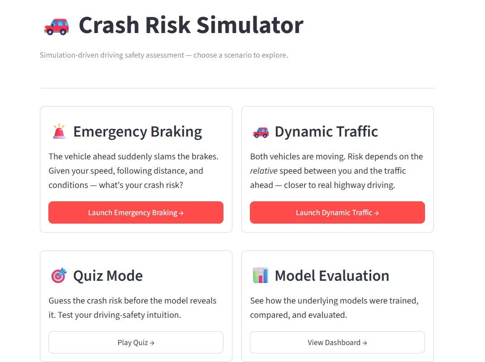

**Weather auto-fill with autocomplete city search**
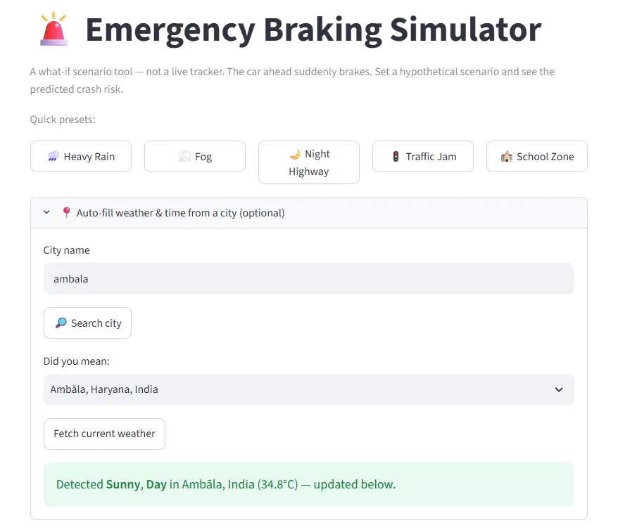

**Scenario inputs**
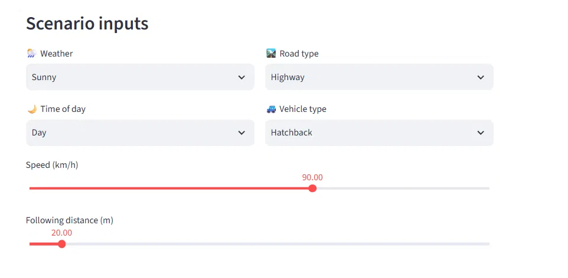

**Risk assessment + risk contribution bars**
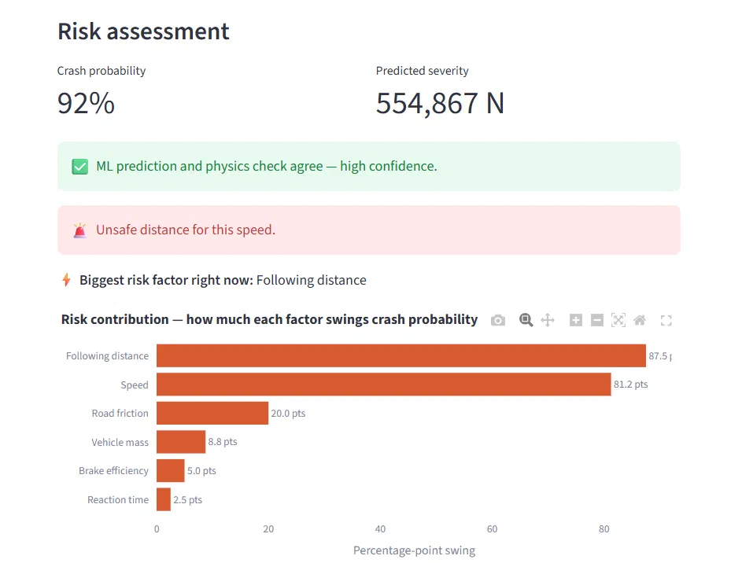

**Actionable recommendations**
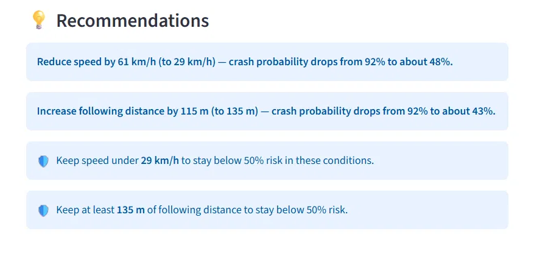

**Sensitivity sweep chart**
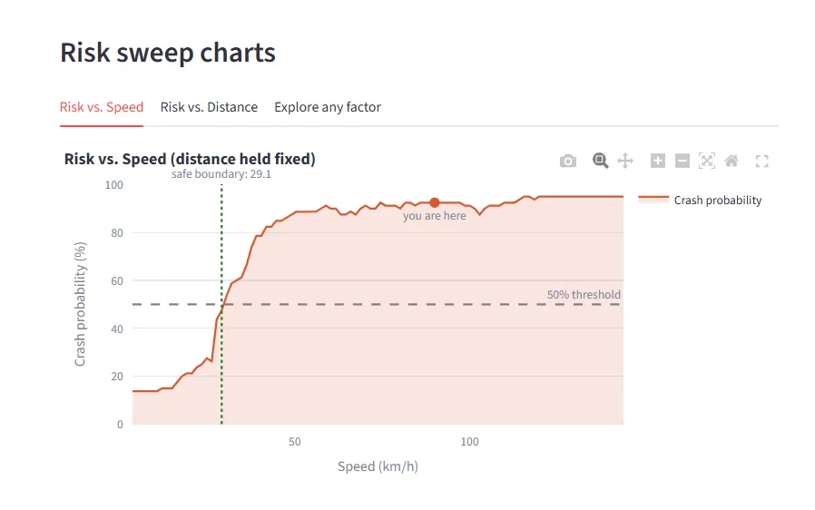

**Per-scenario SHAP explanation**
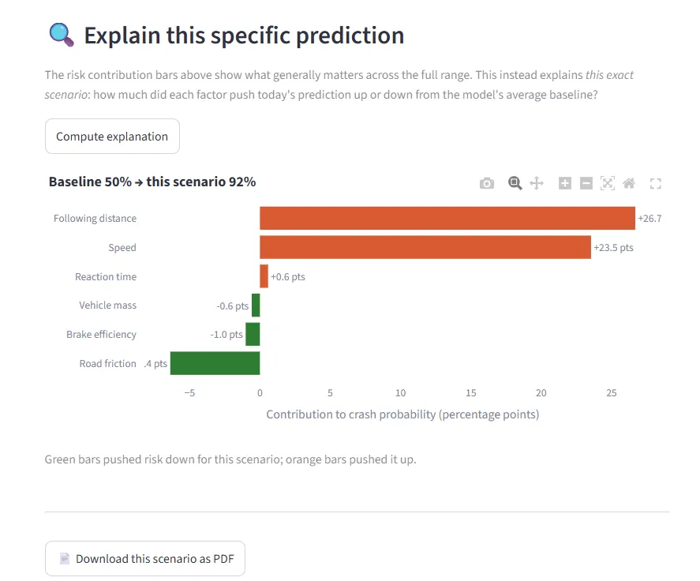

**Dynamic Traffic scenario (relative speed)**
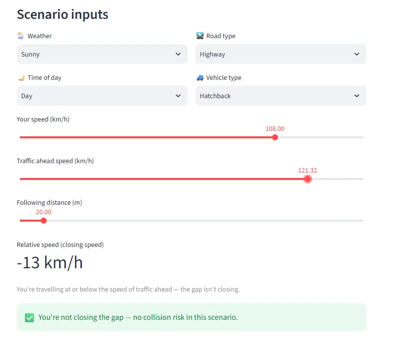

**Quiz Mode**
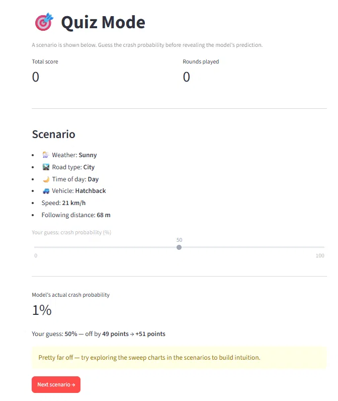

**Model Evaluation Dashboard**
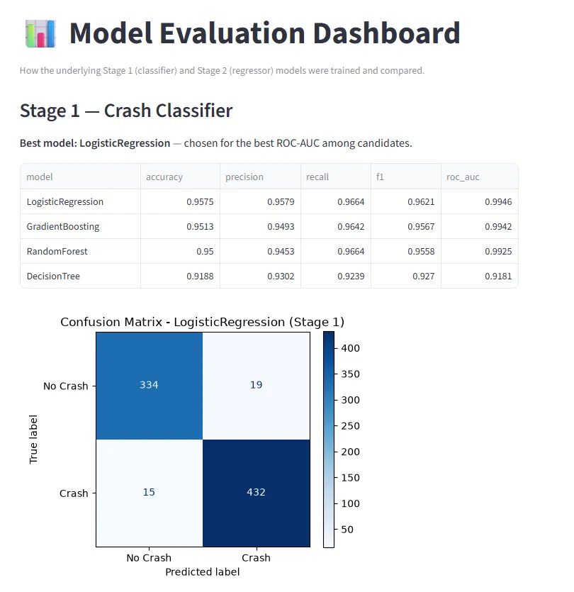
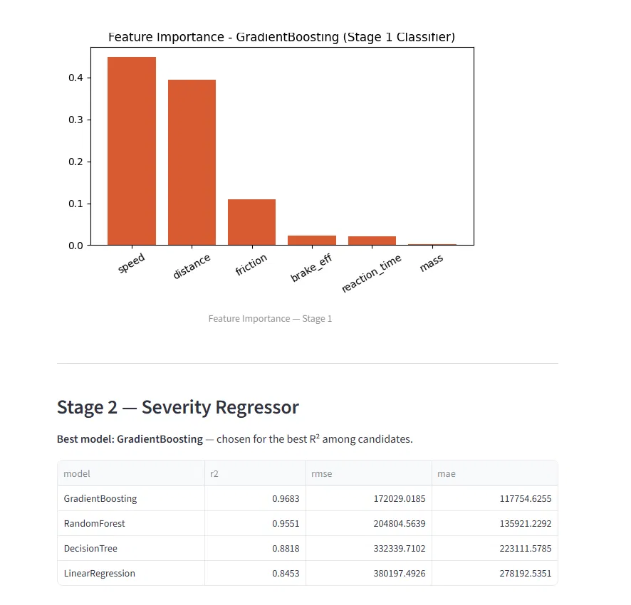

---

## Tech Stack

- **Simulation:** SimPy (discrete-event modeling of the reaction-delay → braking sequence)
- **ML:** scikit-learn (Logistic Regression, Decision Tree, Random Forest, Gradient Boosting — compared per stage, best kept)
- **Explainability:** SHAP (per-scenario, model-agnostic)
- **Physics:** a classical stopping-distance formula, implemented once and reused both to generate training labels and to independently verify live predictions
- **App/UI:** Streamlit, Plotly (interactive charts), Matplotlib (static charts for PDF export)
- **Weather:** Open-Meteo (geocoding + current conditions) — free, no API key required
- **PDF reports:** fpdf2 (pure Python, no compiled dependencies)
- **Deployment:** Streamlit Community Cloud, connected to this GitHub repository

## Project Structure

```
crash-risk-simulator/
├── app.py                       # Streamlit UI — routing, all 4 pages
├── requirements.txt
├── data/
│   └── crash_simulation_data_v2.csv
├── saved_models/
│   ├── stage1_classifier.pkl
│   └── stage2_regressor.pkl
├── results/
│   ├── metrics_summary.json     # full model comparison + metrics
│   ├── stage1_confusion_matrix.png
│   └── *_feature_importance.png
└── src/
    ├── simulation/
    │   ├── dependency_map.py    # categorical → physics parameter mapping
    │   └── generate_dataset.py  # SimPy-based data generator
    ├── physics/
    │   └── crash_physics.py     # stopping-distance formula + verification
    ├── models/
    │   ├── train.py             # trains + compares + saves both stages
    │   └── predict.py           # prediction, sensitivity, safe-value logic
    └── utils/
        ├── weather.py           # Open-Meteo geocoding + current conditions
        ├── explain.py           # per-scenario SHAP explanation
        └── pdf_report.py        # PDF report generation
```

## How to Run Locally

```bash
git clone https://github.com/HarshitCodes16/crash-risk-simulator.git
cd crash-risk-simulator
pip install -r requirements.txt

# 1. Generate the simulated dataset
python src/simulation/generate_dataset.py

# 2. Train both stages (saves .pkl models + metrics/plots)
python src/models/train.py

# 3. Launch the app
streamlit run app.py
```

---

## Engineering Notes 

- **Why simulation instead of real data:** real crash data can't be ethically or safely collected at the scale needed for training; SimPy-based synthetic generation with physically grounded parameter ranges is the standard workaround for exactly this kind of safety-critical, data-scarce domain.
- **Why two-stage instead of one regression:** a single regressor on impact force (with many true zeros for "no crash") conflates "did a crash happen" with "how bad was it" — splitting into classification then conditional regression mirrors how real-world risk-scoring systems (insurance, fraud) are structured.
- **Why a physics verification layer:** a model's confidence score isn't the same as being *correct* — cross-checking against a deterministic, well-understood formula catches cases where the model's output shouldn't be trusted blindly, without needing a second opaque model.
- **Why Dynamic Traffic uses relative speed:** absolute speed alone doesn't determine collision risk in flowing traffic — two cars at 120 km/h with a 2 km/h difference are far safer than the same absolute speed with a 50 km/h difference.
- **A real cross-environment bug worth mentioning:** models trained locally failed to unpickle on the deployment platform due to a scikit-learn version mismatch between environments. Rather than pinning exact versions (fragile across platforms), the app was made self-healing — it detects the failure and retrains fresh, lightweight models in-memory, degrading gracefully instead of crashing.
- **Why SHAP is on-demand, not automatic:** SHAP's exact-computation path for a black-box-wrapped linear model (Logistic Regression) can take several seconds — an acceptable cost for a deliberate, occasional user action, but not for something recomputed on every scenario tweak.

## Future Scope

- **Login + persistent per-user history** — deliberately parked. This isn't "one more feature" — it changes the project's category from an ML system with a UI into a full web application with a backend (external database, secrets management, a proper auth library), and is scoped as its own dedicated project for later.
- **Live sensor integration** — replacing manual sliders/dropdowns with a real speedometer, GPS/radar for following distance, and a live weather feed, turning this into an actual in-vehicle safety alert system (ADAS-style). The input layer is deliberately decoupled from the model/physics pipeline specifically so this swap wouldn't require redesigning the core system.

---

## License

This project is licensed under the [MIT License](LICENSE).
